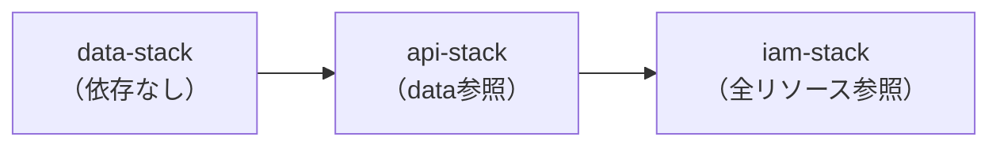

# AWS CDK インフラ定義ガイド

## 概要

本プロジェクトのインフラは **AWS CDK (TypeScript)** で定義します。CDK を採用することで、インフラをコードとして管理し、型安全なリソース定義・差分デプロイ・ドリフト検出が可能になります。

## プロジェクト構成

```
infra/cdk/
├── bin/
│   └── app.ts              # CDK App エントリーポイント
├── lib/
│   ├── stacks/
│   │   ├── api-stack.ts    # Lambda + API Gateway / Function URL
│   │   ├── data-stack.ts   # DynamoDB + S3 + S3 Vectors
│   │   └── iam-stack.ts    # IAM ロール・ポリシー
│   └── constructs/
│       ├── lambda-fastapi.ts   # LWA を使った FastAPI Lambda
│       └── dynamodb-table.ts   # TTL 付き DynamoDB テーブル
├── cdk.json
├── package.json
└── tsconfig.json
```

## スタック設計方針

### スタック分割の理由



- **data-stack**: DynamoDB・S3 などのステートフルリソース。デプロイ頻度が低い
- **api-stack**: Lambda・Function URL などのステートレスリソース。コード変更のたびにデプロイ
- **iam-stack**: 最小権限の IAM。リソース ARN が確定してから定義

### 環境分離

```typescript
// bin/app.ts
const app = new cdk.App();
const env = { account: process.env.CDK_DEFAULT_ACCOUNT, region: "us-east-1" };

new DataStack(app, "ProfileChatData-Dev", { env, stage: "dev" });
new ApiStack(app, "ProfileChatApi-Dev", { env, stage: "dev" });
```

## 主要スタックの実装例

### DataStack

```typescript
// lib/stacks/data-stack.ts
import * as cdk from "aws-cdk-lib";
import * as dynamodb from "aws-cdk-lib/aws-dynamodb";
import * as s3 from "aws-cdk-lib/aws-s3";

export class DataStack extends cdk.Stack {
  public readonly checkpointTable: dynamodb.Table;
  public readonly stateBucket: s3.Bucket;

  constructor(scope: cdk.App, id: string, props: DataStackProps) {
    super(scope, id, props);

    // LangGraph チェックポインター用テーブル
    this.checkpointTable = new dynamodb.Table(this, "CheckpointTable", {
      tableName: `profile-chat-checkpoints-${props.stage}`,
      partitionKey: { name: "thread_id", type: dynamodb.AttributeType.STRING },
      sortKey: { name: "checkpoint_id", type: dynamodb.AttributeType.STRING },
      timeToLiveAttribute: "expires_at",  // TTL 自動削除
      billingMode: dynamodb.BillingMode.PAY_PER_REQUEST,  // サーバーレス課金
      removalPolicy:
        props.stage === "prod"
          ? cdk.RemovalPolicy.RETAIN  // 本番データは保護
          : cdk.RemovalPolicy.DESTROY,
    });

    // 大サイズ状態オフロード用 S3
    this.stateBucket = new s3.Bucket(this, "StateBucket", {
      bucketName: `profile-chat-ai-state-${this.account}-${props.stage}`,
      lifecycleRules: [
        {
          id: "delete-old-states",
          expiration: cdk.Duration.days(90),  // 90日で自動削除
        },
      ],
      removalPolicy: cdk.RemovalPolicy.DESTROY,
      autoDeleteObjects: props.stage !== "prod",
    });
  }
}
```

### ApiStack（Lambda Web Adapter）

```typescript
// lib/stacks/api-stack.ts
import * as lambda from "aws-cdk-lib/aws-lambda";
import * as ecr from "aws-cdk-lib/aws-ecr";

export class ApiStack extends cdk.Stack {
  constructor(scope: cdk.App, id: string, props: ApiStackProps) {
    super(scope, id, props);

    const fn = new lambda.DockerImageFunction(this, "ChatApiFunction", {
      functionName: `profile-chat-api-${props.stage}`,
      code: lambda.DockerImageCode.fromEcr(
        ecr.Repository.fromRepositoryName(this, "Repo", "profile-chat-api"),
        { tagOrDigest: "latest" }
      ),
      memorySize: 512,
      timeout: cdk.Duration.seconds(60),  // ストリーミングのために長めに設定
      environment: {
        DYNAMODB_TABLE: props.checkpointTable.tableName,
        S3_BUCKET: props.stateBucket.bucketName,
        BEDROCK_REGION: "us-east-1",
        PORT: "8000",  // LWA がこのポートをリッスン
        AWS_LWA_INVOKE_MODE: "response_stream",  // ストリーミングモード
      },
    });

    // Lambda Function URL（API Gateway なしで直接 HTTPS エンドポイント）
    const fnUrl = fn.addFunctionUrl({
      authType: lambda.FunctionUrlAuthType.NONE,
      cors: {
        allowedOrigins: ["https://your-portfolio.com"],
        allowedMethods: [lambda.HttpMethod.POST],
      },
      invokeMode: lambda.InvokeMode.RESPONSE_STREAM,  // SSE ストリーミング
    });

    new cdk.CfnOutput(this, "ApiUrl", { value: fnUrl.url });
  }
}
```

## CDK デプロイ手順

```bash
# 依存関係インストール
cd infra/cdk
npm install

# 初回のみ: CDK ブートストラップ
npx cdk bootstrap aws://ACCOUNT_ID/us-east-1

# 差分確認
npx cdk diff ProfileChatData-Dev

# デプロイ（data → api の順）
npx cdk deploy ProfileChatData-Dev
npx cdk deploy ProfileChatApi-Dev

# 全スタック一括デプロイ
npx cdk deploy --all
```

## よくある設定パターン

### Bedrock のアクセス許可

```typescript
// Bedrock は CDK の高レベル Construct が少ないため、手動で IAM 追加
fn.addToRolePolicy(
  new iam.PolicyStatement({
    effect: iam.Effect.ALLOW,
    actions: ["bedrock:InvokeModelWithResponseStream"],
    resources: [
      `arn:aws:bedrock:us-east-1::foundation-model/anthropic.claude-haiku-3-5-v1:0`,
    ],
  })
);
```

### シークレット管理

```typescript
import * as secretsmanager from "aws-cdk-lib/aws-secretsmanager";

// API キーなどを Secrets Manager で管理
const apiSecret = secretsmanager.Secret.fromSecretNameV2(
  this, "ApiSecret", "profile-chat/internal-api-key"
);
apiSecret.grantRead(fn);

// Lambda の環境変数に ARN を渡す（値そのものは渡さない）
fn.addEnvironment("SECRET_ARN", apiSecret.secretArn);
```

## コスト見積もり（月間）

```
Lambda: 1,000リクエスト × 60秒 × 512MB = ~$0.25
DynamoDB: 10,000 read/write ≈ $0.03
S3 state: 10MB ≈ $0.0002
S3 Vectors: 1,000クエリ ≈ $0.04
Bedrock Haiku 3.5: 1M tokens ≈ $4.00
──────────────────────────────────────
合計目安: 月額 ~$5（使用量による）
```

## 関連ドキュメント

- [AWS リソース設計](aws-resources.md)
- [ローカル開発環境](../development/local-setup.md)
